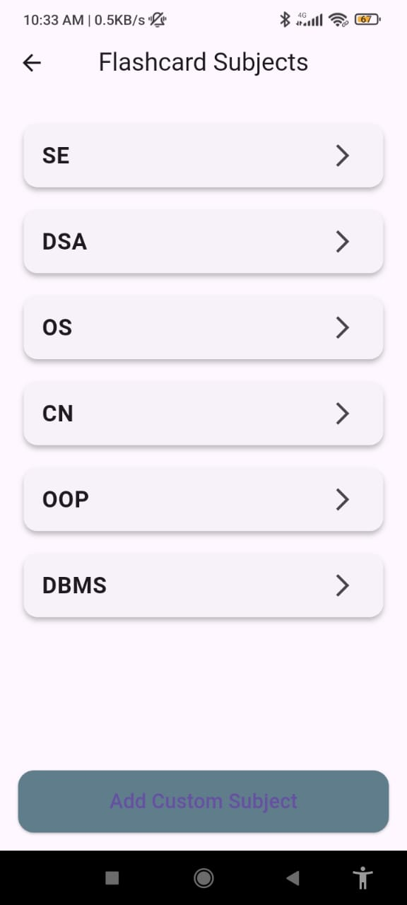
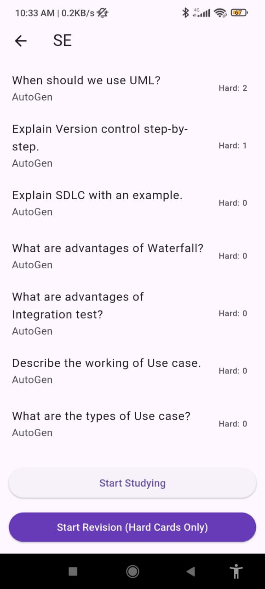

# StudyPrep-using-Flutter
**StudyPrep** is a smart productivity app designed to help students prepare more effectively.
It combines adaptive flashcard learning with an intelligent study planner that automatically generates weekly study timetables based on user-defined subjects and free time slots.

---

#🚀 Features
**Flashcard Learning Module**

Adaptive flashcards with Easy/Hard difficulty
Hard questions are repeated; easy ones skipped
Difficulty score increases automatically
Revision mode → Hard cards only
Supports multiple subjects and topics
Works fully offline using Hive database

**Smart Study Planner Module**

Add unlimited subjects

Add daily/time-based free slots

Automatically generate a balanced weekly study timetable

View daily schedule with clean UI

All data stored locally in Hive

---

#🧱 Tech Stack
| Component        | Technology                            |
| ---------------- | ------------------------------------- |
| Frontend         | Flutter                               |
| Language         | Dart                                  |
| Database         | Hive (offline)                        |
| State Management | Provider                              |
| UI Enhancements  | Flutter Native Splash, Launcher Icons |

---

#⚙️ How It Works
🔹 **Flashcards Module**

  User selects a subject

  Marks cards as Easy or Hard

  Hard cards appear more often

  Difficulty score increases over time

  “Start Revision” mode shows only hard cards

🔹 **Study Planner Module**

  User adds subjects

  Adds daily free time slots (morning/afternoon/night/custom)

  App auto-generates a weekly timetable

  Ensures balanced subject distribution

  Stores the final plan locally

  ---

  ## 📸 Project Screenshots
  

  
  
  
  

  
  
  
  

